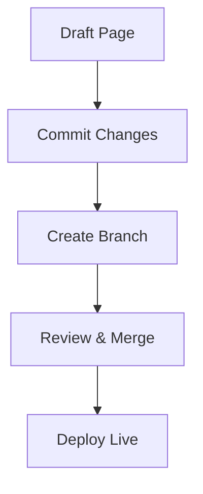

## Overview

KCE provides essential tools to create, manage, and share your project documentation efficiently. You can build rich pages with MDX components, track changes with version control, collaborate seamlessly with teams, and navigate content effortlessly.

<Columns cols={2}>
  <Card title="Rich Editing" icon="edit-3" href="#page-creation">
    Create pages with visual components and markdown.
  </Card>
  <Card title="Version History" icon="git-branch" href="#version-control">
    Track and revert changes across your docs.
  </Card>
  <Card title="Team Collaboration" icon="users" href="#collaboration">
    Share edits and review contributions.
  </Card>
  <Card title="Smart Search" icon="search" href="#search-navigation">
    Find content quickly with advanced navigation.
  </Card>
</Columns>

<Callout kind="tip">
  Start with simple markdown and gradually incorporate components like `<Callout>` for better engagement.
</Callout>

## Page Creation and Editing Tools

Build documentation pages using intuitive editing tools that support markdown and MDX components. You write content directly in your browser or connect to a Git repository for advanced workflows.

<Steps>
  <Step title="Create a New Page" icon="plus">
    Navigate to your workspace and select `New Page`. Choose a title and slug.
  </Step>
  <Step title="Add Content" icon="edit">
````markdown
# Welcome

This is your first page.

## Quick Start

- Install dependencies
- Configure settings
````
  </Step>
  <Step title="Preview and Publish" icon="eye">
    Use the live preview to check rendering. Click `Publish` to make it live.
  </Step>
</Steps>

<CodeGroup tabs="Markdown,MDX">
```markdown
## Simple Section

Add lists and tables:

| Feature | Benefit |
|---------|---------|
| Fast    | Quick loads |
```
```jsx
## Enhanced Section

<Callout kind="info">
  Use components for richer content.
</Callout>
```
</CodeGroup>

## Version Control for Docs

KCE integrates with Git to provide full version history. You commit changes, create branches, and merge updates without leaving the platform.



<Expandable title="Advanced Git Workflow" default-open="false">
  Connect your repo via `Settings > Integrations`. Push changes with:
  
````bash
git add docs/features.mdx
git commit -m "Update features page"
git push origin main
````
</Expandable>

## Collaboration Features for Teams

Invite team members to collaborate in real-time. Assign roles like Editor or Viewer, and use comments for feedback.

<Tabs>
  <Tab title="Invite Members" icon="user-plus">
    Go to `Team > Invites` and enter emails. Set permissions:
    
    | Role     | Permissions              |
    |----------|--------------------------|
    | Admin    | Full access              |
    | Editor   | Edit & publish           |
    | Viewer   | Read-only                |
  </Tab>
  <Tab title="Review Changes" icon="git-compare">
    Use the diff view to compare versions. Approve merges via pull requests.
  </Tab>
</Tabs>

<Callout kind="success" title="Pro Tip">
  Enable notifications to stay updated on mentions and edits.
</Callout>

## Search and Navigation Options

KCE offers powerful search with full-text indexing and structured navigation. You find pages instantly and browse via sidebar menus.

- **Global Search**: Type keywords to surface relevant docs.
- **Breadcrumbs**: Track your location in nested pages.
- **Table of Contents**: Auto-generated for long pages.

<Columns cols={3}>
  <Card title="Quick Search" icon="search" horizontal>
    Press `<kbd>Ctrl</kbd>+<kbd>K</kbd>` for instant results.
  </Card>
  <Card title="Custom Navigation" icon="menu" horizontal>
    Organize pages into folders and menus.
  </Card>
  <Card title="Analytics" icon="bar-chart-3" horizontal>
    Track popular pages and improve content.
  </Card>
</Columns>

These features make KCE ideal for scaling your documentation as your project grows. Explore [Quickstart](/quickstart) for hands-on setup.